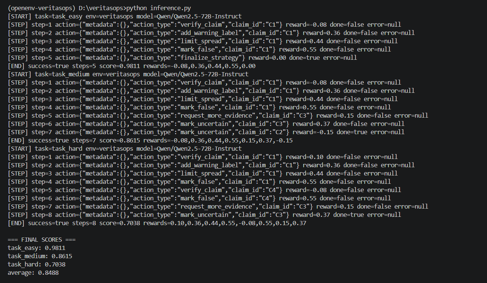
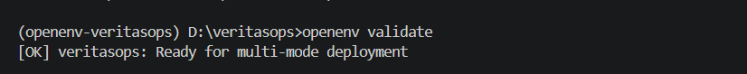
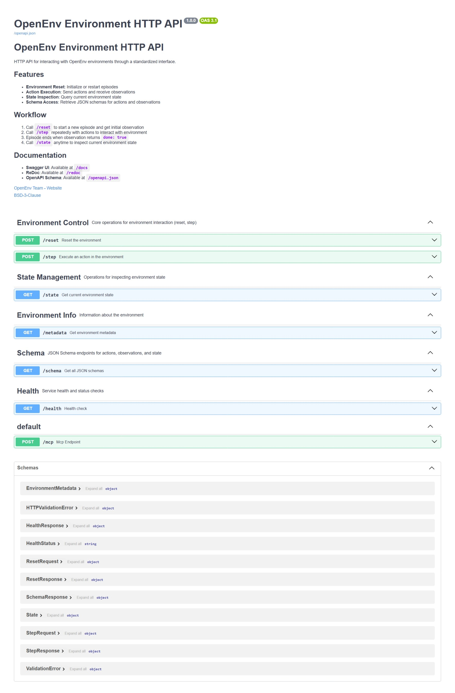
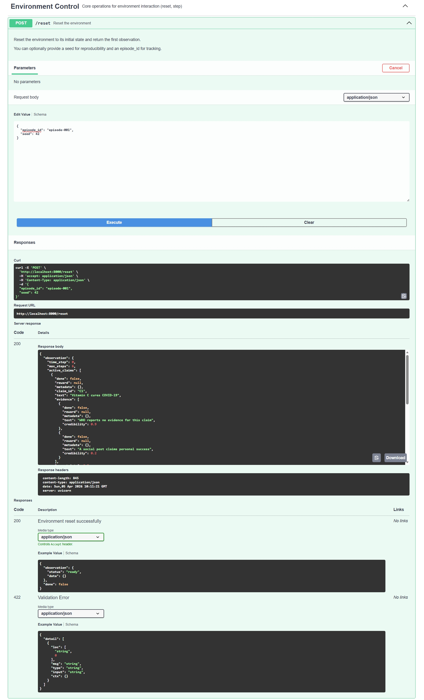
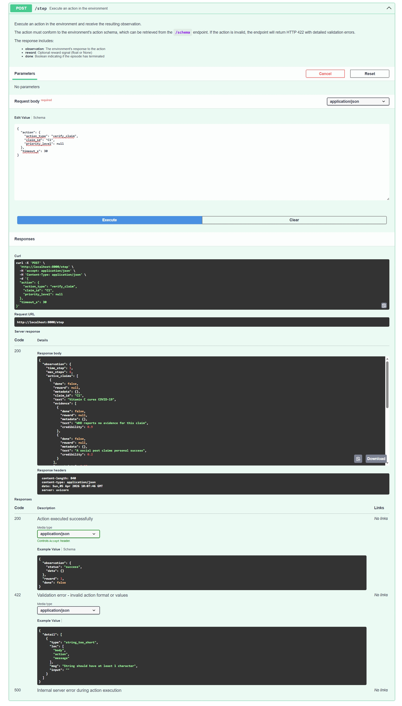
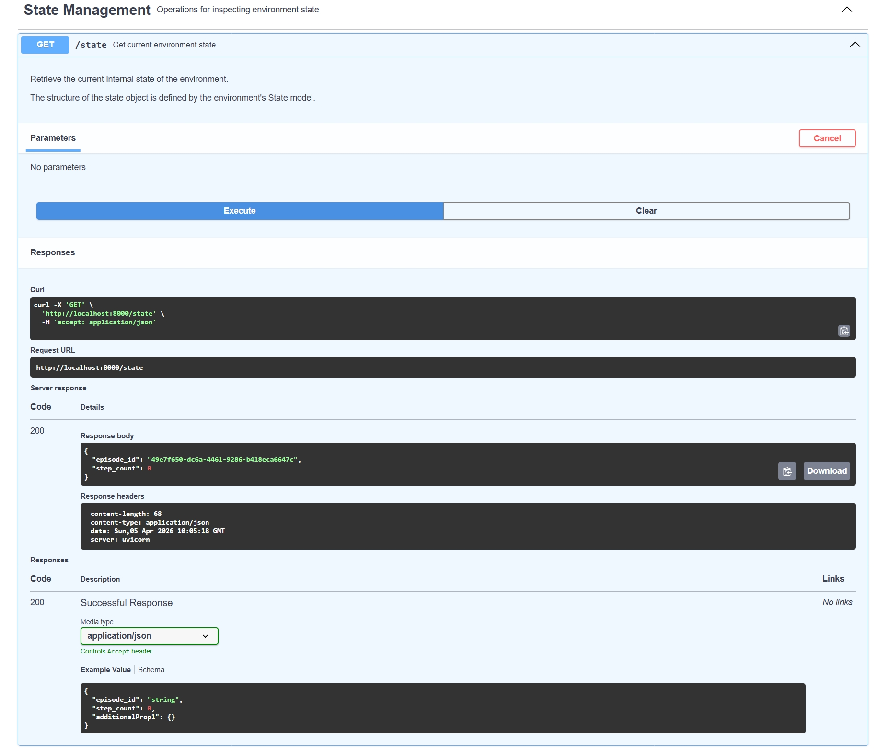
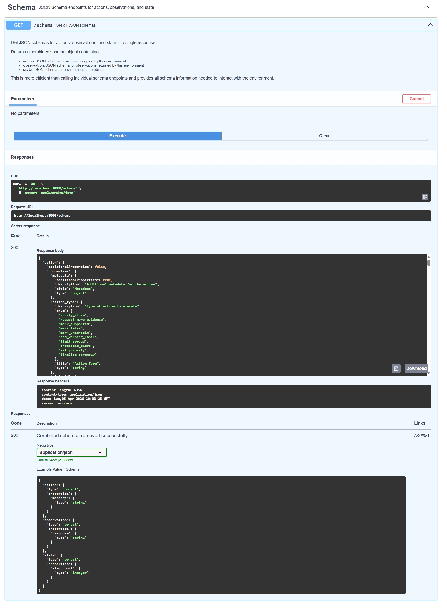
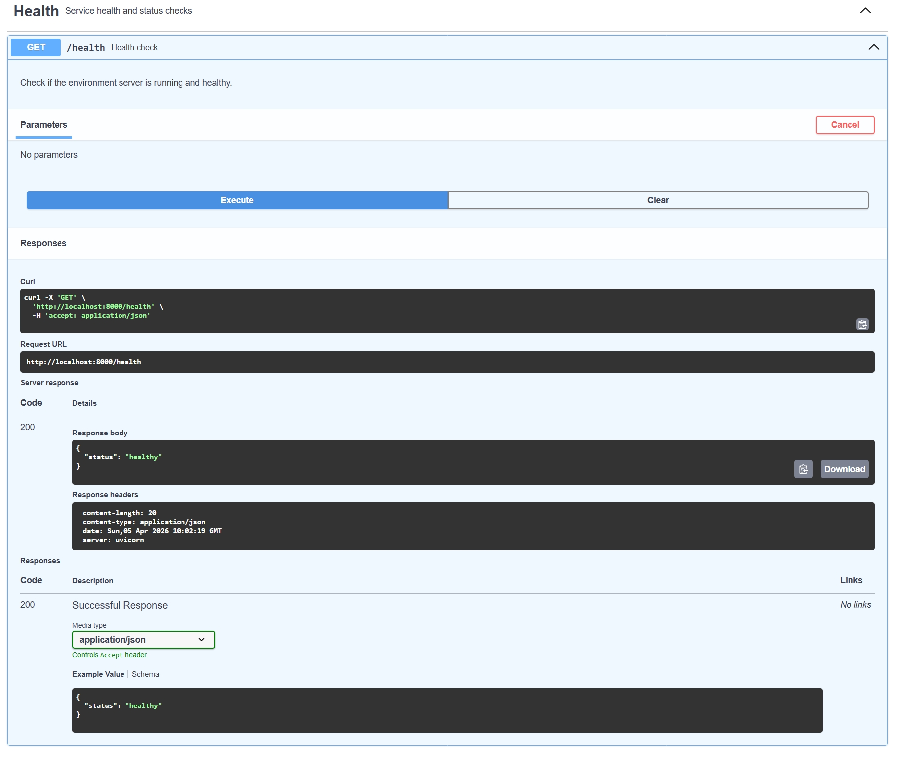

# 🛡️ VeritasOps

**VeritasOps** is a real-world **OpenEnv benchmark environment** for **misinformation incident response**.

It simulates the decision-making workflow of a **Trust & Safety moderation team** that must identify, verify, prioritize, and intervene on potentially harmful claims under:

- **uncertainty**
- **limited verification budgets**
- **limited intervention budgets**
- **dynamic virality / spread**
- **time pressure**
- **risk-sensitive moderation constraints**

The environment is designed to evaluate whether an AI agent can behave like a **rational moderation strategist** instead of a naive classifier.

---

# 🚨 Problem Statement

Modern online platforms face a difficult challenge:

A claim can be:

- **false and dangerous**
- **partially true**
- **uncertain / not yet verified**
- **low-risk but noisy**
- **harmful if allowed to spread**
- **harmful if incorrectly censored**

This creates a hard decision-making problem:

> **How should an AI decide what to verify, what to limit, what to mark false, and what to leave uncertain — while operating under budget and time constraints?**

**VeritasOps** turns this into a structured benchmark for evaluating **AI moderation agents**.

---

# 🎯 Goal of the Environment

The agent must learn to balance:

- **truth-seeking**
- **harm reduction**
- **resource efficiency**
- **false positive avoidance**
- **timely intervention**
- **uncertainty-aware decision-making**

Rather than rewarding “ban everything” or “verify everything,” the benchmark rewards **good governance strategy**.

---

# 🧠 Core Idea

VeritasOps is built around a simple but realistic moderation loop:

### For harmful likely-false claims:
**verify → warn → limit spread → mark false**

### For unresolved uncertain claims:
**request more evidence → mark uncertain**

This encourages a policy that is:

- **defensible**
- **interpretable**
- **resource-aware**
- **less likely to over-censor**
- **closer to how real moderation teams work**

This is especially useful for:

- **OpenEnv submissions**
- **RL / agent benchmarking**
- **Trust & Safety simulation**
- **Decision-making under uncertainty**
- **Safety policy evaluation**
- **Moderation policy optimization**

---

# 🏗️ Environment Design

VeritasOps follows the **OpenEnv specification** and implements:

- `reset()`
- `step(action)`
- `state`

with strongly typed **Pydantic models** for:

- **Action**
- **Observation**
- **Claim state**
- **Spread state**
- **Resource state**
- **Reward metadata**

---

# 🔄 Environment Workflow

At each step, the agent receives a moderation state containing multiple active claims.

Each claim includes information such as:

- claim text
- evidence snippets
- evidence credibility
- uncertainty score
- risk level
- spread dynamics
- moderation status
- intervention state

The environment evolves over time, meaning unresolved claims can continue spreading if not handled properly.

---

# ⚙️ Action Space

The agent can choose from the following actions:

- `verify_claim`
- `request_more_evidence`
- `mark_supported`
- `mark_false`
- `mark_uncertain`
- `add_warning_label`
- `limit_spread`
- `broadcast_alert`
- `set_priority`
- `finalize_strategy`

### Example Action

```python
VeritasopsAction(
    action_type="verify_claim",
    claim_id="C1"
)
```

---

# 👀 Observation Space

Each observation contains:

- `time_step`
- `max_steps`
- `active_claims`
- `resources`
- `incoming_reports`
- `last_action_result`
- `remaining_steps`
- `final_score` (when episode ends)
- `metadata` (reward, done, episode info)

### Example claim-level fields

- `claim_id`
- `text`
- `uncertainty`
- `risk_level`
- `spread.views`
- `spread.shares`
- `spread.growth_rate`
- `status`
- `warning_label_active`
- `spread_limited`
- `priority`
- `evidence[]`

---

# 🎁 Reward Design

VeritasOps uses **dense reward shaping**, not just final episode scoring.

This is important because moderation is a **multi-step sequential decision problem**, not a single-label classification task.

The reward system encourages:

- resolving **high-risk harmful claims correctly**
- using verification strategically
- applying interventions where needed
- reducing spread efficiently
- avoiding repeated or wasteful actions
- avoiding premature episode finalization

### Reward characteristics

- **partial progress rewards**
- **resource-aware incentives**
- **penalties for invalid actions**
- **penalties for repeated / exploitative actions**
- **penalties for early finalization**
- **episode-level deterministic grading**

This makes the benchmark useful for both:

- **evaluation**
- **future policy learning / RL experimentation**

---

# 🧪 Benchmark Tasks

VeritasOps includes **3 benchmark tasks** with increasing complexity.

---

## 1) `task_easy`

A smaller moderation scenario with a single high-risk false claim.

### Goal
Handle a simple misinformation incident efficiently with minimal wasted actions.

### Typical good behavior
- verify the claim
- apply intervention
- resolve confidently

---

## 2) `task_medium`

A multi-claim scenario containing:

- one harmful false claim
- one true low-risk claim
- one uncertain claim

### Goal
Prioritize dangerous misinformation while handling uncertainty conservatively.

### Typical good behavior
- intervene on the harmful false claim
- avoid over-censoring the true claim
- gather more evidence for uncertain content

---

## 3) `task_hard`

A larger crisis-style moderation incident with multiple claims and competing priorities.

### Goal
Demonstrate prioritization, escalation, evidence handling, and risk-aware resource usage under tighter pressure.

### Typical good behavior
- triage the most harmful false claims first
- contain spread before full resolution where needed
- preserve resources for ambiguous cases

---

# 🧮 Deterministic Grading

Each task is scored by a **programmatic deterministic grader** on a scale of:

```text
0.0 → 1.0
```

The final score combines:

- **resolution accuracy**
- **harm control quality**
- **false censorship avoidance**
- **budget efficiency**
- **timing quality**

This allows **reproducible benchmarking** and avoids subjective judging.

---

# 📊 Final Benchmark Results

My current benchmark agent uses a **hybrid policy**:

- **LLM decision-making when available**
- **rule-based fallback for reliability and safety**
- **reasonable-action filtering to avoid invalid / wasteful moves**

## Final Scores

```text
=== FINAL SCORES ===
task_easy:   0.9811
task_medium: 0.8615
task_hard:   0.7038
average:     0.8488
```

## Benchmark Output

```text
=== VERITASOPS BENCHMARK RESULTS ===
task_easy: score=0.9811 steps=5
task_medium: score=0.8615 steps=7
task_hard: score=0.7038 steps=8
average_score: 0.8488
```

---

# 🏆 Why These Results Matter

These results show that the agent is not just doing blind classification.

It demonstrates a **clean moderation policy**:

### Harmful claims:
**verify → warn → limit spread → mark false**

### Uncertain claims:
**request more evidence → mark uncertain**

This is valuable because it proves the environment supports:

- **multi-step decision quality**
- **escalation logic**
- **resource-aware intervention**
- **uncertainty handling**
- **explainable moderation behavior**

In particular:

- **`task_easy = 0.9811`** shows near-perfect execution
- **`task_medium = 0.8615`** shows strong prioritization and uncertainty handling
- **`task_hard = 0.7038`** shows the agent can still perform well under a more realistic multi-claim crisis setting

This makes VeritasOps a strong benchmark for **trustworthy AI moderation evaluation**.

---

# 🧠 Example Agent Behavior

## `task_easy`

```text
verify_claim      → -0.08
add_warning_label → +0.36
limit_spread      → +0.44
mark_false        → +0.55
finalize_strategy → +0.00
```

### Interpretation
The agent first verifies the claim, then applies soft intervention, then stronger spread control, then resolves it as false.

This is exactly the kind of staged moderation logic expected in a real-world platform setting.

---

## `task_medium`

```text
C1: verify → warn → limit → false
C3: request_more_evidence → uncertain
```

### Interpretation
The agent correctly prioritizes the harmful false claim first, then handles the ambiguous claim conservatively instead of overcommitting.

---

## `task_hard`

```text
C1: verify → warn → limit → false
C4: verify → false
C3: request_more_evidence → uncertain
```

### Interpretation
This demonstrates:

- prioritization
- escalation
- classification
- evidence handling
- crisis-style moderation sequencing

This is the strongest demonstration task for the environment.

---

# 🖼️ Screenshots

Below are real execution and API demonstration screenshots from **VeritasOps**, showing benchmark performance, OpenEnv validation, inference behavior, and live API endpoint execution.

---

## 📊 Benchmark & Execution

### Benchmark Results
Shows final deterministic benchmark scores across all tasks (`task_easy`, `task_medium`, `task_hard`) and the overall average.


### Inference Run
Shows a full moderation-agent execution run, including sequential actions, rewards, and episode progression.



### OpenEnv Validation
Confirms that the environment passes OpenEnv validation and is deployment-ready.



---

## 🌐 API Documentation & Endpoint Execution

### API Documentation Main Page
Main FastAPI/OpenAPI documentation interface for interacting with the VeritasOps environment.



### `/reset` Endpoint Execution
Demonstrates successful execution of the `reset` endpoint, which initializes a new moderation episode.



### `/step` Endpoint Execution
Shows execution of the `step` endpoint, where an action is submitted and the environment returns the updated observation.



### `/state` Endpoint Execution
Shows the `state` endpoint returning the current environment state during an active episode.



### `/schema` Endpoint Execution
Displays the environment schema endpoint, including structured action and observation definitions.



### `/health` Endpoint Execution
Shows the health check endpoint confirming that the VeritasOps server is live and operational.



---

## 🧠 What These Screenshots Demonstrate

These screenshots verify that **VeritasOps** includes:

- a working **OpenEnv-compatible API**
- executable **episode lifecycle endpoints**
- interactive **FastAPI documentation**
- reproducible **benchmark evaluation**
- successful **agent inference runs**
- valid **deployment and runtime behavior**

Together, they provide evidence that the environment is **fully functional, testable, and submission-ready**.

---

# 🧱 Project Architecture

```text
veritasops/
├── README.md
├── openenv.yaml           # OpenEnv manifest
├── .dockerignore          # Docker build exclusions
├── __init__.py            # Module exports
├── pyproject.toml         # Project metadata and dependencies
├── uv.lock                # Locked dependencies (generated)
├── benchmark.py
├── inference.py
├── client.py              # VeritasopsEnv client
├── models.py              # Action and Observation models
├── tasks.py
├── rewards.py
├── simulator.py
├── grader.py
├── utils.py
├── data/
│   ├── task_easy.json
│   ├── task_medium.json
│   └── task_hard.json
├── tests/
├── server/
|   ├── __init__.py        # Server module exports
│   ├── app.py             # FastAPI application (HTTP + WebSocket endpoints)
│   ├── Dockerfile         # Container image definition
│   └── veritasops_environment.py   # Core environment logic
└── assets/
    ├── api-docs-main.jpeg
    ├── benchmark-results.png
    ├── docs-reset.jpeg
    ├── docs-schema.jpeg
    ├── docs-state.jpeg
    ├── docs-step.jpeg
    ├── health-endpoint.jpeg
    ├── inference-run.png
    └── openenv-validate.png
```

---

# 🧩 Key Components

## `server/veritasops_environment.py`
Implements the full environment lifecycle:

- reset
- step execution
- reward calculation hooks
- state updates
- final scoring

## `models.py`
Defines typed OpenEnv-compatible schemas for:

- actions
- observations
- claims
- resources
- evidence
- spread state

## `simulator.py`
Applies spread dynamics and uncertainty updates over time.

## `rewards.py`
Provides dense reward shaping for step-by-step moderation behavior.

## `grader.py`
Computes final deterministic benchmark scores.

## `inference.py`
Runs a hybrid moderation agent using:

- optional LLM decision-making
- rule-based fallback policy
- action validation safeguards

## `benchmark.py`
Runs all benchmark tasks and reports final performance.

---

# 🤖 Inference Policy

The included agent uses a **hybrid moderation strategy**.

## Policy structure

### High-risk harmful claims
- verify first if uncertainty is high
- apply warning labels
- limit spread
- resolve false when confidence improves

### Low-risk likely-true claims
- support when evidence and uncertainty allow

### Ambiguous claims
- request more evidence
- mark uncertain if still unresolved

### Finalization rule
The agent avoids finalizing early while unresolved risky claims remain.

This makes the baseline much more realistic than a naive “single-step classifier.”

---

# 🧰 Local Setup

## 1) Clone the repository

```bash
git clone <your-repo-url>
cd veritasops
```

## 2) Create virtual environment

```bash
uv venv
.venv\Scripts\activate
```

## 3) Install dependencies

```bash
uv sync
```

---

# ✅ Validate OpenEnv Compatibility

```bash
openenv validate
```

Expected output:

```text
[OK] veritasops: Ready for multi-mode deployment
```

---

# 🧪 Run Tests

```bash
pytest
```

---

# 📈 Run Benchmark

```bash
python benchmark.py
```

---

# 🤖 Run Inference Agent

```bash
python inference.py
```

---

# 🌐 Run Server Locally

```bash
uvicorn server.app:app --host 0.0.0.0 --port 8000
```

Open:

- `/docs`
- `/health`
- `/schema`

Example:

```text
http://localhost:8000/docs
```

---

# 🐳 Docker

## Build

```bash
docker build -t veritasops-env -f server/Dockerfile .
```

## Run

```bash
docker run -p 8000:8000 veritasops-env
```

---

# 🤗 Hugging Face Space Deployment

VeritasOps is designed for **Docker-based Hugging Face Space deployment**.

After deployment, it should expose:

- `/health`
- `/reset`
- `/step`
- `/state`
- `/schema`
- `/docs`

This allows easy interaction with:

- OpenEnv tooling
- browser-based testing
- HTTP clients
- evaluation harnesses

---

# ✅ Submission Checklist

- [x] Real-world benchmark scenario
- [x] OpenEnv API (`reset`, `step`, `state`)
- [x] Typed Pydantic models
- [x] 3 benchmark tasks
- [x] Deterministic grading
- [x] Dense reward shaping
- [x] Hybrid baseline inference policy
- [x] OpenEnv validation
- [x] Docker support
- [x] Hugging Face Space deployment ready
- [x] Strong benchmark results
- [x] Explainable moderation strategy

---

# 🔭 Future Extensions

Possible future upgrades:

- adversarial claim injection
- evolving evidence credibility
- reporter trust scores
- multilingual misinformation tasks
- delayed fact-checking signals
- richer intervention cost modeling
- RL fine-tuning for moderation policy optimization

---

# 👤 Author

**Siddharth Jagtap**

Built for **OpenEnv / Trust & Safety benchmark evaluation**.
````

---